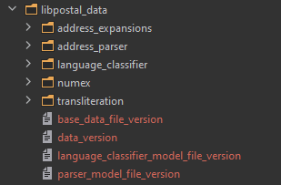
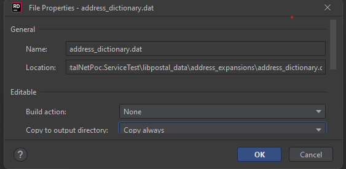

# Required to extecute test

* Download inside this folder the lib data info from [this link](https://github.com/rkramer1964/PKLibPostalNetData/releases/download/1.0.0/libpostal.zip)
* Unzip the downloaded file directly inside this folder (following image shows the expected result)
  * 
* Finally set all .data files as Copy always (right click on file + properties) see the following image
  * 